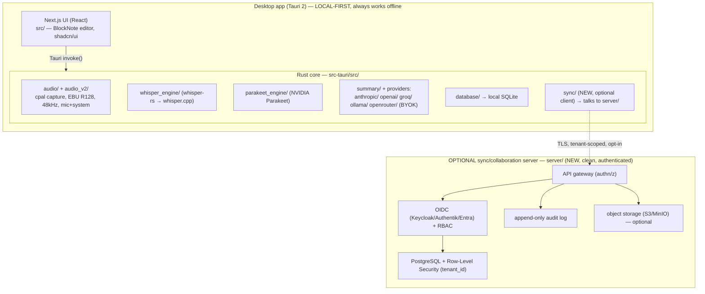

# CLAUDE.md — Project Constitution

> This file governs how Claude Code agents work in this repository. It supersedes generic assumptions.
> It is a **superset** of the upstream `Zackriya-Solutions/meetily` CLAUDE.md: inherit the upstream engineering notes (audio pipeline, Tauri command patterns, platform quirks) and layer the **enterprise + local-first + future multi-tenant** rules below on top.

**Product name (working codename):** `Mityu` — an enterprise, local-first meeting/field-conversation intelligence app derived from Meetily (MIT). Working name; finalize before public launch + trademark filing.
**Bundle identifier:** `com.bluedev.mityu` (replace with your real reverse-domain if different).
**Not affiliated with Meetily/Zackriya Solutions, and must NOT use the "Meetily" name or branding.** We ship under our own brand (`Mityu`). The MIT copyright notice for Zackriya Solutions MUST be preserved in `LICENSE` (code license ≠ trademark; keeping the notice is required).

---

## 0. Prime Directives (read before every task)

1. **Local-first is the product, not a feature.** Capture, transcription, and (by default) summarization run **on the user's device**. The app MUST remain fully functional with **no network and no server**. Never introduce a hard dependency on a remote service into the core capture→transcript→summary→store path.
2. **Server is optional and additive.** Team/enterprise/SaaS capabilities arrive through an **optional sync/collaboration server**. If the server is unreachable, the desktop app keeps working on local data.
3. **Tenant-aware by design, single-tenant in practice (for now).** Every persisted domain entity carries a `workspace_id` (local) / `tenant_id` (server) from day one. In local-first mode this is a single implicit workspace. **Do not** scatter code that assumes a global, tenant-less world — that is the #1 thing that makes a future SaaS migration a rewrite. See `docs/MULTITENANCY.md`.
4. **The Python/FastAPI `backend/` is LEGACY and ARCHIVED.** Per upstream: it had unauthenticated, dev-only CORS. **Do not** build on it, resurrect it as a runtime dependency, or copy its security posture. You MAY read it for data-model/prompt reference only. The future server is a **new, clean, authenticated service** (`server/`), not the archived backend.
5. **Human-in-the-loop for every AI output.** Summaries, action items, and extracted facts are **drafts** until a human approves. Bind every AI-generated item to its **source transcript segment + timestamp**. This is required for trust, for dispute/claim evidence value, and for EU AI Act Article 50 transparency.
6. **Privacy & compliance are architectural, not bolt-on.** Encryption at rest, audit trail, retention/redaction policy, and explicit recording consent are first-class. See `docs/SECURITY_PRIVACY.md`.
7. **Never hardcode secrets or paths.** LLM API keys live in the OS keychain / Tauri secure store, never in source or plaintext config. Use Tauri path APIs for cross-platform paths.
8. **Small, reversible steps.** Prefer additive changes behind a flag over big-bang refactors. When you touch the audio pipeline or the DB schema, treat it as high-risk (see §4, §6).

---

## 1. What this app is (and is not)

**Is:** An offline-capable desktop app that records meetings / on-site conversations, transcribes them locally, produces structured, source-linked summaries and action items, and lets a user search and export them. Designed to grow into a team product (shared workspaces, admin, audit) and later a managed multi-tenant SaaS — **without abandoning local-first**.

**Is not:** A cloud recorder that streams your audio to someone else's servers (that is the competitor category we differentiate from). Not a meeting bot that joins calls **by default** — a call-joining bot may exist only as an explicit, consent-gated opt-in integration and the core never depends on it (ADR-0018). Not an autonomous agent that takes irreversible actions without approval.

---

## 2. Verified architecture (ground truth from the code)

The supported app is a **Tauri 2 desktop app**: a Rust core (`frontend/src-tauri/`) with a **Next.js** UI (`frontend/src/`). The Rust core owns capture, transcription, LLM calls, and local storage. **There is no required server today.**



**Legacy (do not build on):** `backend/` = Python FastAPI + `pydantic-ai` + `aiosqlite` + Ollama, archived. Keep its structured-summary schema (`Block` / `Section` / `MeetingNotes`) as a **reference schema** only.

### Component ownership (who does what — do not blur these)
| Concern | Owner | Location | Notes |
|---|---|---|---|
| Audio capture / mixing / normalization | Rust | `src-tauri/src/audio*`, `recording_manager.rs` | Fragile & critical. See §4. |
| Transcription | Rust | `whisper_engine/`, `parakeet_engine/` | **whisper-rs** builds whisper.cpp from source (GPU features); models: whisper `large-v3`, Parakeet. The `backend/whisper.cpp` submodule serves only the archived backend |
| Summarization / extraction | Rust | `summary/`, provider modules, `llama-helper` crate | Provider-agnostic; BYOK; **must be swappable**; embedded local llama.cpp path + in-app model manager |
| Local persistence | Rust | `database/` → SQLite | Local cache = source of truth in local-first |
| UI / editor / state | Next.js | `src/` | BlockNote is the canonical editor; TipTap/Remirror are legacy—do not add new deps to them |
| Sync (client) | Rust | `src-tauri/src/sync/` (NEW) | Opt-in, tenant-scoped |
| Multi-tenant server | New service | `server/` (NEW) | Phase 2+. Not the legacy backend. |

---

## 3. Tech stack & canonical choices (avoid drift)

- **Desktop shell:** Tauri 2. Plugins in use: `dialog`, `fs`, `log`, `notification`, `process`, `single-instance`, `store`, `updater`. Prefer these over custom native code.
- **UI:** Next.js + React + Tailwind + shadcn/ui + **BlockNote** (rich text). **Canonical editor = BlockNote.** TipTap and Remirror also appear in deps — treat as **legacy**, do not extend, migrate away when touched.
- **Rust:** `anyhow::Result` for app errors; `tracing`/`log` for logging with module context; `cpal` for audio; `ebur128` for loudness. Run `cargo fmt` + `cargo clippy` before PR.
- **LLM providers (BYOK):** OpenAI, Anthropic/Claude, Groq, Ollama (local), OpenRouter — plus an embedded local llama.cpp path (`llama-helper` crate + in-app model manager). Keys stored in OS keychain / Tauri store — never in SQLite plaintext, never in source.
- **Local STT:** whisper.cpp via **whisper-rs** (`large-v3` default) and Parakeet (faster). Model files are large; load once and cache; changing model requires reload/restart.
- **DB (client):** SQLite. **DB (server, Phase 2+):** PostgreSQL with Row-Level Security. Client SQLite becomes a local cache that syncs.
- **Analytics:** PostHog, **opt-in only** (there is an explicit consent switch). Never send transcript/meeting content to analytics. Telemetry must be disableable for enterprise.
- **Future server language:** default to **Rust/Axum** for one-language cohesion with the Tauri core, OR a clean **FastAPI** service if the team prefers Python; decide in `docs/DECISIONS.md` before writing server code. Either way it is authenticated and multi-tenant from commit #1.

---

## 4. High-risk zone: the audio pipeline (handle with extra care)

Upstream flags this as the most fragile subsystem. Rules:
- Pipeline expects a **consistent 48kHz** sample rate; resample at capture time.
- System-audio capture needs a virtual device (BlackHole on macOS, WASAPI loopback on Windows) and **macOS 13+ screen-recording permission**; request permissions early.
- Devices are named **"microphone"** and **"system"** consistently — never "input"/"output".
- Do not refactor `audio/` and `audio_v2/` together in one pass. If both exist, first document which is authoritative in `docs/DECISIONS.md`, then converge behind a flag.
- Any audio change requires a manual smoke test (record → transcript appears) on at least one macOS and one Windows path before merge.

---

## 5. Quality gates (definition of done)

A change is done only when:
1. **Builds:** `pnpm run tauri:dev` (or `./clean_run.sh`) compiles; Rust `cargo build` clean.
2. **Lints:** `cargo clippy --all-targets` has no new warnings; `pnpm run lint` + `pnpm tsc --noEmit` clean.
3. **Local-first invariant holds:** feature works with the network OFF (or, if it is a server feature, the app still starts and core capture works with the server OFF).
4. **Tenant invariant holds (server code):** no query/read over tenant data without tenant scoping (RLS or explicit `tenant_id`). See `/tenant-check`.
5. **Secrets/paths:** no hardcoded secrets or paths (hooks enforce a first pass).
6. **HITL preserved:** no new path publishes AI output without human approval + source link.
7. **Docs updated:** if you changed architecture or schema, update the relevant file in `docs/` and add an ADR to `docs/DECISIONS.md`.
8. **Tests:** add/adjust tests for new server endpoints and non-trivial Rust logic.

---

## 6. Database & schema changes (high-risk)

- **Client SQLite** and **server Postgres** schemas must stay **compatible** (same logical entities; see `docs/DATA_MODEL.md`).
- Every migration is **forward-only, reversible-documented, and idempotent**. Never edit an applied migration; add a new one.
- Every domain table has: `id` (uuid), `workspace_id`/`tenant_id`, `created_at`, `updated_at`, and (for sync) `updated_by`, `version`/`rev`, `deleted_at` (soft delete).
- Use `/db-migration` to author migrations. A schema change to a synced table also requires a sync-compatibility note.

---

## 7. How to work (agent workflow)

1. **Orient first.** New to this repo? Start at **`BOOTSTRAP.md`** (the exact startup sequence). For any task: read this file, then the relevant `docs/` doc, then the upstream CLAUDE.md engineering notes, then the actual code you will touch. Do not guess file locations — grep. Document index:
   - `BOOTSTRAP.md` — ordered startup prompts & gates (run first).
   - `docs/SETUP.md` — dev environment prerequisites.
   - `docs/BACKLOG.md` — the ordered, executable task list (work top-to-bottom).
   - `docs/PHASE0_VALIDATION.md` — the make-or-break transcription gate (human-reviewed).
   - `docs/ARCHITECTURE.md`, `docs/MULTITENANCY.md`, `docs/DATA_MODEL.md`, `docs/CONTRACTS.md`, `docs/SCAFFOLD.md` — the design + the seams + where code goes.
   - `docs/CONVENTIONS.md` — coding/testing/commit standards. `docs/SECURITY_PRIVACY.md` — security & compliance. `docs/DECISIONS.md` — ADR log.
2. **Pick the right subagent.** See `.claude/agents/`. Route audio work to `audio-pipeline-engineer`, server/tenancy work to `sync-server-architect` + `multitenancy-guardian`, etc.
3. **Use the workflows.** Slash commands in `.claude/commands/` encode the repeatable, safe procedures (feature, fix-bug, add-tauri-command, prep-multitenant, tenant-check, security-review, db-migration, audio-debug, release).
4. **Stay in your lane.** Do not touch capture internals for a UI ticket. Do not add server calls for a local feature.
5. **When blocked or ambiguous, state the assumption inline and proceed on the smallest safe interpretation** — do not stall, but do not invent product scope.

---

## 8. Commands cheat-sheet (from upstream, verified)

```bash
# In /frontend
pnpm install
pnpm run dev            # Next.js dev server on port 3118
pnpm run tauri:dev      # full Tauri dev (scripts/tauri-auto.js auto-detects the GPU variant)
pnpm run tauri:build    # production build
./clean_run.sh          # clean build + run (macOS); add 'debug' for debug logs
clean_run_windows.bat   # clean build + run (Windows); build.ps1 / build-gpu.ps1 also available
# GPU variants: pnpm run tauri:dev:cpu | :cuda | :vulkan | :metal | :coreml | :openblas | :hipblas
```

Dev frontend port: **3118**. Do not reintroduce the legacy backend ports/services as required infrastructure.

---

## 9. Licensing & IP guardrails

- Base is **MIT** (Zackriya Solutions) — commercial use, modification, and closed distribution are permitted; **keep the MIT copyright notice**. `whisper.cpp` submodule is also MIT.
- **Do not** ship under the "Meetily" name/logo. Use our own brand assets.
- **Model licenses are separate from code:** verify the license/terms of any STT model (whisper weights, NVIDIA Parakeet) and any LLM provider's API terms before commercial distribution. Note this per-model in `docs/DECISIONS.md`.
- Cloud LLM usage is governed by each provider's ToS; BYOK shifts that responsibility to the customer — surface this in-product.

---

## 10. Definition of "do not do"

- Do not stream raw audio/transcripts to any third party by default.
- Do not add cross-tenant queries or a "god mode" that bypasses tenant scoping.
- Do not resurrect the legacy `backend/` as a production dependency.
- Do not persist LLM API keys in SQLite plaintext or commit them.
- Do not publish AI output without human approval + source-segment linkage.
- Do not refactor the audio pipeline and the DB schema in the same change.
