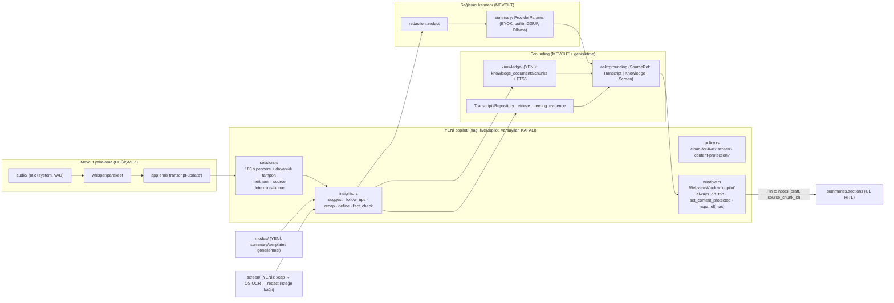

# Cluely-sınıfı canlı yardımcı: rakip analizi, boşluk matrisi ve Mityu geliştirme planı

> **Statü:** Analiz + uygulanabilir plan (sahip onayı bekler). Tarih: 2026-09-11.
> **İlişkili kayıtlar:** BACKLOG **EPIC I** (görev listesi), **ADR-0038** (sınırlar ve kararlar), `ROADMAP.md` Phase I, `STRATEGY_2026-2030.md` §2 (parite tablosu).
> **Bu doküman ne DEĞİL:** Cluely ile karşılaştırmalı bir pazarlama metni değildir. `STRATEGY_2026-2030.md` §10 kuralı geçerlidir: bir rakibi adıyla anan hiçbir iddia, birincil kaynaktan teyit edilip hukuk onayı alınmadan ürün/landing/pazarlamada kullanılmaz. Bu doküman yalnızca **iç mühendislik planlaması** içindir.

---

## 0. Özet (yöneticiler için)

- **Cluely'nin çekirdeği** tek bir şeydir: toplantı *sırasında*, kullanıcının ekranında yalnızca kendisinin gördüğü bir panelde **canlı yardım** ("ne söylemeliyim", takip soruları, anlık recap, doğrulama, kişi bağlamı) + ekran bağlamı + şirket bilgi tabanıyla grounding; sonrasında notlar/özet. Bunun etrafında bir kurumsal katman (admin konsolu, bilgi tabanı, CRM/ATS senkronu, SSO/RBAC, analitik) ve bir de tartışmalı **"tespit edilemezlik"** konumlanması var.
- **Mityu'nun çekirdeği** ise bunun tam tersi bir zaman diliminde güçlü: kayıt → yerel transkripsiyon → kaynak-bağlı, insan-onaylı özet/aksiyon → arama/Ask → export. Toplantı **sırasında** yardım eden hiçbir yüzeyi yok; `Ask This Meeting` bile kayıt sonrasında çalışır.
- **En büyük boşluk:** canlı yardımcı paneli (overlay), global kısayollar, yerel bilgi tabanı (doküman grounding), ekran bağlamı, toplantı türüne göre "mod" davranışı, kayıt-sonrası "tarifler" (takip e-postası, iç güncelleme vb.) ve isteğe bağlı proaktif öneri.
- **Bilinçli reddettiklerimiz:** "tespit edilemez/stealth" konumlanması (process disguise, dock/taskbar gizleme, klavye kancası ile odak çalmadan yazma), aday tarafı mülakat/sınav "kopya" modları, sürekli ekran kaydı, üçüncü kişileri web'de profilleme, duygu/performans "koçluk" skorları, otonom gönderim. Bunlar anayasa (`CLAUDE.md` §0.5/§0.6/§10), KVKK/GDPR ve EU AI Act Art. 50 ile çelişir ve teknik olarak da güvenilmez (macOS 15+'ta içerik koruması ScreenCaptureKit tarafından yok sayılıyor — §4.3).
- **Konumlanma cümlesi:** *"Özel ama gizli değil"* — panel yalnızca kullanıcıya görünür (ekran paylaşımından **gizlilik** amaçlı korunur; platform gerçekleri dürüstçe etiketlenir), ama uygulama varlığını **hiçbir zaman** gizlemez; kayıt rıza kapısı aynen geçerlidir; her öneri yapay-zekâ etiketli, kaynak-bağlı bir **taslaktır**.
- **Plan:** BACKLOG **EPIC I (I0–I9)**: pencere kabuğu + kısayollar → deterministik canlı bağlam servisi → isteğe bağlı içgörüler (öner / takip soruları / recap / tanım) → modlar → yerel bilgi tabanı → ekran bağlamı → kayıt-sonrası parite → proaktif/ledger/brief → **etkinleştirme kapısı (I9)**. Mekanikler flag-arkasında (varsayılan KAPALI) A5/C8'den önce inebilir (C1/C3a emsali); **varsayılan AÇIK** ve her "canlı yardım" iddiası **A5 GO + I9** ister.

---

## 1. Yöntem ve kaynak durumu

1. **Mityu envanteri** koddan çıkarıldı (`frontend/src-tauri/src/*`, `frontend/src/*`, `docs/*`), tahmin değil; §5'teki her satır dosya yoluyla doğrulanabilir.
2. **Cluely:** `cluely.com` ve `docs.cluely.com` bu geliştirme ortamının ağ proxy'sinde **engelli** olduğundan doğrudan okunamadı. Özellik envanteri üç dolaylı kaynaktan kuruldu: (a) arama motoru üzerinden görülen **docs.cluely.com sayfa başlıkları ve özetleri** (Live Insights, Pre Call Briefs, Meeting Notes, Undetectability, Settings, Limitations, Knowledge Base, Customization Suite, Admin Training, Role Management, CRM/ATS Integrations, Team Wide Kickoff, Changelog), (b) Cluely'nin **kendi GitHub organizasyonu** (`cluely-cli`, proprietary), (c) 2026 tarihli üçüncü-taraf incelemeler ve karşılaştırmalar. **Sonuç:** envanter *yüksek güvenle* doğru ama **birincil kaynaktan yeniden teyit şartı** (§12) baki; özellikle fiyat ve gecikme rakamları kaynaklar arasında çelişkili.
3. **Natively (referans repo):** `Natively-AI-assistant/natively-cluely-ai-assistant` klonlandı ve **kod düzeyinde** incelendi (mimari, modül sınırları, davranış politikaları). **Lisans uyarısı (kritik):** *Natively Personal Use Source License v1.0* — **yalnızca kişisel/eğitim/araştırma/ticari-olmayan kullanım**; ticari kullanım ve türev ürün **yazılı izin gerektirir**. Mityu ticari bir üründür → **Natively'den tek satır kod, prompt veya varlık alınmaz.** Yalnızca *tasarım referansı* (hangi problem hangi mimariyle çözülmüş) olarak kullanıldı. Aynı kural GPL-3.0 projeler (Glass, Cue, Cheating-Daddy, Pluely'nin eski sürümleri) için de geçerlidir (MIT ürüne GPL kod alınmaz). İzin verici referanslar §4'te işaretlidir.
4. **Diğer OSS:** GitHub `cluely-alternative` / `open-source-cluely` konu etiketleri tarandı; Tauri-tabanlı olanlara ve içerik-koruma (ekran paylaşımından gizleme) tekniklerinin **platform gerçeklerine** özellikle bakıldı.

---

## 2. Cluely — özellik envanteri (2026)

| # | Özellik | Ne yapıyor (kaynaklarda anlatıldığı gibi) | Kaynak sınıfı |
|---|---|---|---|
| C1 | **Canlı overlay** | Her zaman üstte, yarı saydam, taşınabilir küçük panel; Cmd/Ctrl+Enter ile yanıt; "yalnızca sizin gördüğünüz" | Ana sayfa özeti, incelemeler |
| C2 | **Live Insights** | "What should I say next", "Follow up questions", "Fact check", "Who am I talking to", "Recap" | docs: `feature/liveinsights` |
| C3 | **Ses girişi** | Sistem sesi + mikrofon, bot yok, çağrıya katılmaz; Zoom/Meet/Teams/Webex/Slack huddles fark etmez; 12+ dil | Ana sayfa, incelemeler |
| C4 | **Ekran girişi** | Ekranı OCR ile "görür", bağlam olarak LLM'e verir (kod problemi, slayt, doküman) | İncelemeler, sızan sistem prompt'u |
| C5 | **Meeting Notes (post-call)** | Ana tartışma noktaları özeti, AI-taslak "next steps", konuşmacı ayrımlı tam transkript, önemli çıkarımlar; recap + takip soruları | docs: `feature/postcall` |
| C6 | **Pre Call Briefs** | Takvimden (Google Calendar) katılımcıları tanır, **profesyonel profillerini araştırır**, toplantı bağlamını çeker, brief üretir | docs: `feature/precall` |
| C7 | **Custom knowledge / Knowledge Base** | Satış senaryosu, el kitabı, çalışma notu yükleme (bireysel); Enterprise'da admin-yönetimli RAG bilgi tabanı (PDF/DOC/DOCX/TXT/MD), çağrı sırasında gerçek-zamanlı kullanım; yalnız adminler düzenler | docs: `enterprise/knowledgebase`, incelemeler |
| C8 | **Customization Suite** | Kurum için prompt'lar, bilgi tabanları, takım konfigürasyonları; üyeler aktif prompt'u seçer | docs: `enterprise/customizationsuite` |
| C9 | **Admin konsolu / Teams / Analytics** | `enterprise.app.cluely`; takımları bölüm/bölgeye göre düzenleme, toplu import, takım-özel izinler; "post-call coaching & analytics", ROI raporlama | docs: `enterprise/admintraining`, incelemeler |
| C10 | **Role Management / SSO / directory sync** | RBAC, IdP ile SSO, kullanıcı provizyonu | docs: `enterprise/rolemanagement`, incelemeler |
| C11 | **CRM/ATS entegrasyonu** | Merge.dev üzerinden Salesforce/HubSpot/Pipedrive/Zoho vb.; anlık/saatlik/günlük senkron, rate limit | docs: `enterprise/integrations` |
| C12 | **Undetectability** | Pro+ katmanında ekran paylaşımı yakalamasından gizli overlay ("GPU seviyesi" iddiası); 2026'da dokümanlar "completely undetectable" → "minimizes detection risk" diye yumuşatılmış | docs: `feature/undectability`, incelemeler |
| C13 | **Settings / kısayollar** | Kısayolları düzenleme ve tamamen kapatma | docs: `feature/settings` |
| C14 | **Cluely Mobile (iOS)** | Telefonu yüz-yüze toplantılar için not alıcıya çevirir; gürültü bastırma; "send to desktop" | App Store, `cluely.com/mobile` |
| C15 | **Desktop Widget** | Daha az müdahaleci not-alma modu | İncelemeler |
| C16 | **CLI** | `cluely-cli` (Go, proprietary): oturum listele/görüntüle/güncelle/sil/etiketle, oturum başlangıç/bitişini izle, daemon; OS keyring ile auth | GitHub `cluely/cluely-cli` |
| C17 | **Satış copilot davranışı** | Pitch önerisi, takip soruları, dinamik talk-track, itiraz karşılama, battlecard | Karşılaştırma yazıları, sızan prompt ("Objection: [ad]") |
| C18 | **Fiyat** | Free (5 yanıt/gün), Pro ~$19.99/ay ($11.99 yıllık), Pro+Undetectability ($75–$149.99 arası çelişkili), Enterprise (~$200/koltuk; büyük sözleşmeler) | İncelemeler, `cluely.com/pricing` başlığı |
| C19 | **Gecikme** | İddia ~300 ms; bağımsız testler 3–10 s | İncelemeler |
| C20 | **Güven sicili** | 2025 ortası ~83k kullanıcıyı etkileyen veri sızıntısı (transkript + ekran görüntüleri sunucuda tutuluyordu) | İncelemeler, Natively README |

**Sızan sistem prompt'undan öğrenilen davranış kuralları** (ürün tasarımına girdi, kopyalanmaz): önce cevap, sonra açıklama; soru tespiti ~%50 güvenle; yeni soru yokken teknik/discovery anlatımlarda 1–3 takip sorusu; satışta "Objection: [genel ad] → konuşma diliyle karşılık"; son 10–15 kelimedeki özel ad/terim için tanım; meta-cümle yok; özetleme istenmeden yapılmaz.

---

## 3. Natively — referans repo analizi (kod düzeyinde)

**Yığın:** Electron 43 + React/Vite; Rust `native-module` (napi) ile ses yakalama (cpal, WASAPI, macOS `cidre`/ScreenCaptureKit), WebRTC VAD + RMS, `rubato` resampler; SQLite + `sqlite-vec`; STT: yerel Whisper/Moonshine/Parakeet-CTC + 9 bulut sağlayıcı; LLM BYOK (Gemini/OpenAI/Anthropic/Groq/NIM/Ollama/LiteLLM/OpenAI-uyumlu).

**Mimari desenler (öğrenilen, yeniden tasarlanacak):**

| Alan | Natively'de nasıl | Mityu için çıkarım |
|---|---|---|
| **Overlay / panel** | `electron/WindowHelper.ts`: `type:'panel'`, `setContentProtection`, `setVisibleOnAllWorkspaces(visibleOnFullScreen)`, `setAlwaysOnTop('screen-saver')`, `setIgnoreMouseEvents(forward)`; `native-module/src/stealth_window.rs` ile NSPanel `becomesKeyOnlyIfNeeded`, `hidesOnDeactivate=NO`, `collectionBehavior` (tüm space'ler + fullscreen auxiliary) | Tauri'de aynı ihtiyaç `WebviewWindowBuilder` + `tauri-nspanel` (MIT/Apache) ile karşılanır; **odak çalmayan panel** UX'in kalbi. |
| **Stealth** | `process_name.rs` (LaunchServices SPI ile Activity Monitor adını canlı değiştirme), dock/taskbar gizleme, `keyboard_tap.rs`/`keyboard_hook_windows.rs` (CGEventTap / WH_KEYBOARD_LL ile odak almadan yazma) | **REJECT.** Aldatma amaçlı; klavye kancası keylogger-benzeri güvenlik yüzeyi; anayasa ile çelişir. |
| **Çift kanal** | Sistem sesi = "interviewer/them", mikrofon = "user/me" — diyarizasyon olmadan konuşmacı ayrımı | Mityu'da veri zaten var: `TranscriptUpdate.source` (`microphone`/`system`, `audio/transcription/worker.rs:30`). UI'da gösterilmiyor → I1'de gösterilir. |
| **Canlı zekâ** | `IntelligenceEngine` + `LiveTranscriptBrain`: 180 s sıcak pencere + dayanıklı tam pencere; deterministik soru çıkarımı; ara (interim) sonuçta spekülatif çıkarım; `autoAnswer/AutoAnswerJudge` (LLM "cevapla/sessiz kal" hakemi, 2.5 s deadline, prefilter); `dynamic-actions` (mod başına regex tetikleyiciler → `EvidenceRef` taşıyan aksiyon kartları) | I2 (deterministik pencere + cue), I3 (isteğe bağlı içgörü), I8 (opt-in proaktif hakem). Evidence-ref zorunluluğu Mityu'nun `source_chunk_id` invariant'ıyla birebir örtüşür. |
| **Modlar** | 9 yerleşik mod (`builtinModes.ts`) + `mode-policy-registry.ts`: mod başına izinli kaynaklar, grounding politikası (SOURCE_FIRST vs OPEN_KNOWLEDGE), "iddia sınıfı → kanıt zorunlu" bayrakları, bütçeler, auto-answer eşikleri, atıf görünürlüğü; özel modlar; `SKILL.md` (YAML frontmatter) ile "skills" + saf validator ve kurulum önizlemesi | I4: `summary/templates` → `modes` genellemesi; politika alanları benimsenir; **aday tarafı mülakat modları alınmaz.** |
| **Bilgi tabanı** | Referans dosyalar → deterministik "knowledge pack/card" (OKF), kaynağa karşı doğrulama, yeniden sıralayıcı; yerel RAG (`sqlite-vec`, yerel embedding) | I5: FTS5-öncelikli yerel bilgi tabanı (Evidence Search altyapı emsali), embedding = PI slice 4 ile birlikte. |
| **Post-call** | `MeetingSummaryV3` (tldr/decisions/actionItems(owner, deadline, explicitness, evidence)/openQuestions/risks/timeline/people), `FollowUpDraftGenerator` (mod başına "ses"), `MeetingRecipes` (Slack update, CRM note, MEDDIC, investor update, recruiting scorecard, study notes…), `CrossMeetingRecall` (deterministik taşınan açık sorular/tekrarlayan riskler), `SpeakerLabelService` (elle yeniden adlandırma), coaching insights (**ürün kararıyla KAPATILMIŞ** — düşük değer) | I7: onaylı içerik üstünde deterministik "tarifler", çapraz-toplantı hatırlatma, elle konuşmacı adı. Koçluk: Mityu'da zaten etik sınır dışı. |
| **Ekran** | Ekran görüntüsü → vision sağlayıcı zinciri (OCR yolu kapatılmış), perceptual hash önbelleği, gizli-bilgi temizleme, Chrome uzantısı ile sayfa DOM'u | I6: isteğe bağlı yakalama, önizleme+onay, OS-yerel OCR, redaksiyon, kalıcı değil. Tarayıcı uzantısı: ertele (EPIC G). |
| **Entegrasyon** | Google Calendar (token değişimi **Natively API'sine proxy'lenir**), Phone Mirror (LAN websocket + QR), Jira/Linear/Asana export (README iddiası; kod bulunamadı), Codex CLI | Takvim: ADR-0018 ile **istemci-direkt OAuth**, token keychain'de, proxy YOK. Telefon eşliği: ertele. |
| **Kullanım defteri** | Token/maliyet takibi, gecikme izi | I8: içerik-içermeyen `usage_events`. |

**Cluely'de olup Natively'de olmayanlar:** kurumsal admin konsolu + takım analitiği, admin-yönetimli merkezi bilgi tabanı, Merge.dev CRM/ATS, SSO/RBAC/directory sync, katılımcı web-araştırmalı pre-call brief, iOS uygulaması, CLI, post-call koçluk. **Natively'de olup Cluely'de olmayanlar:** yerel Whisper/Ollama (tam offline), çift kanal, yerel RAG/geçmiş, process disguise, phone link, hands-free auto-answer, skills, tarayıcı uzantısı, BYOK/çok-anahtar havuzu.

---

## 4. Diğer açık kaynak manzarası ve platform gerçekleri

### 4.1 Projeler

| Proje | Lisans | Yığın | Öne çıkan | Mityu için kullanım |
|---|---|---|---|---|
| **Pluely** (iamsrikanthnani) | v1 **kapalı**; eski sürümler GPL-3 | **Tauri** + React; `tauri-nspanel` | Ask/Listen modları, duraklama sonrası otomatik öneri, takip "chip"leri, curl-şablonlu özel sağlayıcı, bilgi dosyaları, ~10 MB | Tauri'de yapılabilirliğin kanıtı; kod alınmaz |
| **Cue** (Blueturboguy07) | GPL-3.0 | Electron, whisper.cpp yerel | "Assist", "What should I say?", "Follow-up questions", "Recap", "You/Them" kanalları; `setContentProtection` — macOS 15.4+ için "best-effort" notu | Özellik seti = C2'nin sade hâli; kod alınmaz |
| **OpenCluely** (TechyCSR) | **Apache-2.0** (MIT de anılıyor) | Electron, Gemini | Görünmez overlay, VAD, görüntü analizi, oturum belleği, kısayollar, bölge yakalama; Linux'ta içerik koruması "yok" notu | İzin verici referans (desen düzeyinde) |
| **Glass** (pickle-com) | GPL-3.0 | Electron + Firebase | Ask/Listen/Meeting Notes/Live Summaries/Proactive; Rust AEC | Bulut bağımlılığı; kod alınmaz |
| **Cheating-Daddy** (sohzm) | GPL-3.0 | Electron, Gemini Live | Profiller (Interview/Sales/Meeting/Presentation/Negotiation), click-through | Kod alınmaz |
| **Ghostbar** | belirsiz | Swift (native macOS) | Ekran paylaşımına görünmez sohbet | — |
| **Screenpipe** | kaynak-açık (Mityu ses yakalamada zaten kredi veriyor) | Rust/Tauri, `tauri-nspanel` kullanıcısı | Olay-güdümlü 7/24 ekran+ses kaydı, erişilebilirlik ağacı + OCR fallback | Sürekli kayıt modeli **reddedilir**; isteğe bağlı OCR fikri alınır |
| **Granola** (kapalı rakip) | — | Masaüstü | 2026: Recipes, Chat with meetings, Spaces, MCP, Briefs | Recipes ve Briefs kavramları I7/I8'i doğrular |

### 4.2 İzin verici yapı taşları (Mityu'nun MIT ürünüyle uyumlu)

- **Tauri 2 pencere API'leri** (MIT/Apache): `set_content_protected`, `always_on_top`, `transparent`, `decorations(false)`, `set_ignore_cursor_events`, `set_visible_on_all_workspaces`, `focusable(false)`, `shadow`. Notlar: `set_skip_taskbar` **macOS'ta desteklenmez** (zaten kullanmayacağız); saydam pencere Windows'ta v1/v2 arasında tutarsız (tauri#8308) → saydamlık başarısızsa opak panele düş.
- **`tauri-plugin-global-shortcut`** (MIT/Apache; masaüstü-only) — panel aç/kapat, "öner", "ekranı yakala" kısayolları; Wayland kısıtları belgelenir.
- **`tauri-nspanel`** (MIT/Apache; Cap ve Screenpipe üretimde kullanıyor) — macOS'ta odak çalmayan NSPanel (fullscreen üstünde görünme).
- **`xcap`** (Apache-2.0) — çapraz platform ekran/pencere yakalama; **Wayland desteklenmez** (Linux'ta özellik "kullanılamaz" der).
- OCR: Windows `Windows.Media.Ocr` (`windows` crate ile), macOS Vision framework (objc2 üzerinden) — `inference/` yetenek probe'u (ADR-0033) arkasında; yoksa yalnızca **onaylı** vision-uyumlu sağlayıcı.

### 4.3 Platform gerçeği: "ekran paylaşımından gizli" ne kadar gerçek?

- **Windows:** `SetWindowDisplayAffinity(WDA_EXCLUDEFROMCAPTURE)` (Windows 10 2004+) DWM tarafından uygulanır; Zoom/Meet/Teams/OBS paylaşımından çıkarır. Eski Windows'ta pencere **siyah kutu** olur. Meşru kullanımı yaygındır (parola diyalogları, DRM). Tauri `set_content_protected` bunu sarmalar.
- **macOS:** `NSWindow.sharingType = .none` yalnızca eski CoreGraphics yakalamayı engeller; **macOS 15+ (özellikle 15.4+) ScreenCaptureKit bunu yok sayar** — Apple DTS yanıtı: *"At this time there are no public APIs for preventing screen capture."* (Apple Developer Forums thread 792152; tauri#14200 açık, "upstream"). Yani macOS'ta gizleme **garanti edilemez**.
- **Linux:** eşdeğeri yok.
- **Sonuç:** Cluely'nin "GPU seviyesi görünmezlik" pazarlaması bizim için hem etik hem teknik olarak izlenmez. Mityu'da içerik koruması bir **gizlilik** özelliğidir (paylaşım sırasında özel notların sızmaması), panelde **platform-başına dürüst etiket** taşır ("Windows: paylaşımdan gizli · macOS: en-iyi-çaba · Linux: yok") ve hiçbir zaman "tespit edilemez" diye anılmaz.

---

## 5. Mityu — bugünkü envanter (koddan)

| Yetenek | Durum | Kanıt |
|---|---|---|
| Yerel gerçek-zamanlı transkripsiyon (Whisper large-v3 / Parakeet), GPU | ✅ | `whisper_engine/`, `parakeet_engine/` |
| Mikrofon + sistem sesi ayrı kanallar, VAD, EBU R128 mix | ✅ (kanal bilgisi UI'da yok) | `audio/`, `TranscriptUpdate.source` |
| Kayıt rıza kapısı (Rust bileti, 60 s TTL, AuthContext'e bağlı) | ✅ | `recording_consent.rs` |
| Kaynak-bağlı yapılandırılmış özet + HITL onay (C1), aksiyon maddeleri (C2) | ✅ | `summary/structured.rs`, `summaries`/`action_items` |
| Evidence Search FTS5/BM25 (C3a), Action Center (C3b) | ✅ | `api::api_search_evidence`, `/actions` |
| **Ask This Meeting** (retrieval-first, grounding, refusal, Art. 50(1)+(2) etiketli) | ✅ *kayıt sonrası* | `ask/{service,grounding,commands}.rs`, `AskThisMeeting/AskPanel.tsx` |
| Export PDF/DOCX/MD + makine-okunur Art. 50 provenance (C4) | ✅ | `buildExportProvenance` (ADR-0032) |
| SQLCipher at-rest, keychain BYOK, opt-in redaksiyon | ✅ | ADR-0014/0011/0015, `redaction::redact` |
| Özet şablonları (5 yerleşik JSON + kullanıcı dizini) | ✅ (yalnız özet şekli) | `summary/templates/`, `src-tauri/templates/*.json` |
| Öğrenme: HITL düzeltmelerinden düz-dil kurallar | ✅ | `learning/` (ADR-0030) |
| Diyarizasyon (post-hoc, anonim Speaker N) + konuşma süresi | ✅ (isim verme UI'ı yok) | `diarization/`, `report/SpeakerTurns.tsx` |
| Tray kayıt kontrolleri, bildirimler (MeetingReminder tipi var) | ✅ | `tray.rs`, `notifications/` |
| Import & retranscribe, lisanslama (Polar), opt-in analytics | ✅ | — |
| Yetenek probe'u + OS-native backend seam (uykuda) | ✅ seam | `inference/` (ADR-0033) |
| Ajanlar seam (uykuda, draft-only) · Sync seam (uykuda) | ✅ seam | `agents/`, `sync/` (ADR-0013/0012) |
| Tek pencere (`main`, 1100×700), global kısayol **yok**, ikinci pencere **yok** | — | `tauri.conf.json`, `Cargo.toml` (plugin listesi) |
| Toplantı *sırasında* yardım · ekran bağlamı · bilgi tabanı · modlar · tarifler · takvim | ❌ | — (G2 takvim planlı, F2 takip-taslağı planlı) |

---

## 6. Boşluk matrisi ve kararlar

Karar sözlüğü: **ADOPT** (aynı değeri Mityu tarzında kur) · **ADAPT** (kısıtlarla uyarlanır) · **DEFER** (planlı ama sonra) · **REJECT** (bilinçli yapılmaz).

| Özellik (Cluely/Natively) | Mityu | Karar | Nereye | Gerekçe / kısıt |
|---|---|---|---|---|
| Canlı overlay paneli (odak çalmayan, her zaman üstte, kompakt) | ❌ | **ADOPT** | I1 (`copilot/window.rs`, `/copilot` route) | Kategori çekirdeği. Ekran-paylaşım koruması *gizlilik* özelliği; dürüst platform etiketi. Uygulama dock/taskbar'da **görünür kalır**. |
| Global kısayollar, düzenlenebilir keybind, "hepsini kapat" | ❌ | **ADOPT** | I1 | `tauri-plugin-global-shortcut`. |
| "Me/Them" canlı atıf | **veri yok** — `TranscriptUpdate.source` üretici tarafında her segment için sabit `"Audio"` (I2'de koda karşı doğrulandı; ADR-0039) | **DEFER** | Ses hattı `source`'u gerçekten taşıyınca (ayrı, §4 smoke'lu `audio/` işi — BACKLOG H13) | `copilot::session::Channel{Microphone,System,Unknown}` ve "mikrofondan cue yok" kuralı şimdiden yazılı ve testli; üretici düzelince kopilotta hiçbir şey değişmez. Sesten kimlik çıkarımı **yok** (ADR-0034). |
| "What should I say next" (öneri) | ❌ | **ADAPT** | I3 | Yalnızca kayıt-rızası verilmiş oturumun transkript penceresinden; kaynak-bağlı; yapay-zekâ etiketli **taslak**; yerel model varsayılan. |
| "Follow up questions" | ❌ | **ADOPT** | I3 | 1–3 soru, her biri tetikleyici segmente bağlı. |
| Canlı "Recap" | yalnız kayıt sonrası | **ADOPT** | I3 | Pencere üstünden; kalıcı değil; "Pin to notes" ile taslak blok. |
| "Fact check" | ❌ | **ADAPT** | I3 + I5 | **Yalnızca** transkript + yerel bilgi tabanına karşı; web'e karşı doğrulama **yok** (egress). |
| "Who am I talking to" | ❌ | **ADAPT** | I8 (G2'ye bağlı) | Yalnız yerel kaynaklar: takvim metadata (opt-in) + aynı katılımcılarla önceki toplantılar + açık onaylı aksiyonlar. **Web profilleme yok** (KVKK: üçüncü kişi verisi). |
| Terim tanımı (son 10–15 kelime) | ❌ | **ADOPT** | I3 ("Define") | Bilgi tabanı öncelikli; yoksa model bilgisi, etiketli. |
| Ekran bağlamı (OCR/vision) | ❌ | **ADAPT** | I6 | **İsteğe bağlı** tek kare; önizleme+onay; OS-yerel OCR; redaksiyon; diske/DB'ye yazılmaz; sürekli kayıt **REJECT**. |
| Bilgi tabanı (bireysel + admin-yönetimli RAG) | ❌ | **ADOPT (yerel) / DEFER (takım)** | I5; takım = EPIC D sonrası | `knowledge_documents/chunks` + FTS5 (Evidence Search emsali), `workspace_id` + sync kolonları ilk günden → sunucu KB additive. Embedding = PI slice 4. |
| Modlar / personalar / özel prompt'lar / skills | kısmi (şablon) | **ADOPT** | I4 | `summary/templates` → `modes`; **aday tarafı mülakat/sınav/kodlama-çözücü modları REJECT**. |
| Post-call notlar (özet, next steps, konuşmacılı transkript) | ✅ | — | — | Zaten var; recap/follow-up soruları I3 ile canlıya taşınır. |
| Takip e-postası taslağı, "recipes" (Slack/CRM notu/MEDDIC…) | ❌ (F2 planlı) | **ADAPT** | I7 (deterministik) → F2 (LLM cilası, C8 sonrası) | Yalnızca **onaylı** içerik üstünde; kopyala/export; **gönderim yok**. |
| Çapraz-toplantı hatırlatma (taşınan açık sorular, tekrarlayan riskler) | ❌ | **ADOPT** | I7 | Deterministik projeksiyon (ADR-0025 tarzı). |
| Konuşmacı etiketlerini yeniden adlandırma | ❌ | **ADOPT** | I7 | **Elle**; sesten öneri yok (ADR-0034 etik sınır). |
| Hands-free Auto Answer / proaktif öneri | ❌ | **ADAPT** | I8 | Varsayılan **KAPALI**; sessiz "teklif chip'i"; asla otomatik konuşma/aksiyon. |
| Pre-call brief | ❌ | **ADAPT** | I8 (G2 sonrası) | Yalnız yerel/opt-in kaynaklardan. |
| Kullanım/maliyet istatistiği | ❌ | **ADOPT** | I8 | İçerik-içermeyen `usage_events`; BYOK şeffaflığı. |
| Takvim entegrasyonu | ❌ (G2) | **DEFER** | EPIC G | ADR-0018; istemci-direkt OAuth. |
| CRM/ATS push (Merge.dev) | ❌ | **DEFER** | EPIC G (onay-kapılı) | HITL: "gönder" insan adımıdır. |
| Admin konsolu, takım analitiği, SSO/RBAC, directory sync, takım KB/promptlar | ❌ | **DEFER** | EPIC D (D2/D4) | Sunucu Phase 2; şema bugünden tenant-hazır. |
| Mobil uygulama / telefon eşliği | ❌ | **DEFER** | Faz 3+ | Strateji: masaüstü-öncelikli. |
| CLI (oturum yönetimi) | ❌ | **DEFER** | sonra | SQLCipher anahtarı keychain'de; export/automation ihtiyacı doğunca. |
| Tarayıcı uzantısı ile sayfa bağlamı | ❌ | **DEFER** | EPIC G | Opt-in entegrasyon; ekran bağlamı (I6) ihtiyacın çoğunu karşılar. |
| "Undetectable" / stealth / process disguise / dock gizleme / klavye kancası | ❌ | **REJECT** | — | Aldatma; anayasa §0.6; macOS'ta zaten çalışmıyor; güvenlik yüzeyi. |
| Post-call **koçluk** skorları, iletişim boşluğu analizi | ❌ | **REJECT** | — | Duygu/performans çıkarımı sınırı (EU AI Act, `DESIGN_READAI.md`). Natively de kapattı. |
| Aday tarafı mülakat/sınav yardımı, LeetCode çözücü | ❌ | **REJECT** | — | Değerlendirme bütünlüğü; marka riski; hedef pazar (regüle kurumsal) ile çelişir. |
| Web araması ile "fact check" | ❌ | **REJECT (varsayılan)** | — | Egress; ileride opt-in BYOK arama ayrı ADR ister. |
| Sürekli ekran kaydı (Rewind/screenpipe modeli) | ❌ | **REJECT** | — | Gizlilik, depolama, KVKK. |

---

## 7. İlke kararları (ADR-0038'in özü)

1. **Özel, gizli değil.** Panel yalnızca kullanıcıya görünür ve ekran paylaşımından *gizlilik* için korunur; uygulama varlığını hiçbir yolla gizlemez (taskbar/dock'ta kalır, süreç adı değişmez, kayıt göstergesi görünür). "Undetectable" kelimesi ürün/pazarlamada **yasak**.
2. **Copilot kendi başına dinlemez.** Yalnızca **rıza bileti tüketilmiş bir kayıt oturumunun** `transcript-update` akışını tüketir. Ayrı bir "sessiz dinleme" modu yoktur; yakalama kodu (`audio/`) **değiştirilmez** (§4 risk bölgesi).
3. **Her içgörü etiketli, kaynak-bağlı, kalıcı-olmayan bir taslaktır.** Panelde ilk açılışta Art. 50(1) bildirimi ("Bir yapay zekâ asistanıyla etkileşiyorsunuz"), her kartta kaldırılamaz "AI-generated · verify" işareti (ADR-0032 deseni); her iddia `source_chunk_id` (ve I5 ile `knowledge_chunk_id`) taşır; pencere dışına atıf **düşürülür, onarılmaz** (`ask::grounding`). Kalıcılık yalnızca "Pin to notes" ile ve **draft** statüsünde `summaries.sections`'a.
4. **Dışsal aksiyon yok.** Copilot metin üretir; göndermez, oluşturmaz, tıklamaz. Araç çağrısı yok (OWASP LLM01: transkript/ekran/bilgi tabanı **güvensiz girdidir**).
5. **Ekran isteğe bağlıdır.** Tek kare, önizleme + onay, OS-yerel OCR öncelikli, redaksiyon sonrası prompt, diske/DB'ye yazılmaz (kullanıcı "kanıt olarak ekle" demezse), çalışma-alanı politikasıyla kapatılabilir.
6. **Bilgi tabanı yerel ve kiracı-kapsamlıdır.** Metin SQLCipher içinde; `workspace_id` + sync kolonları ilk günden; negatif çapraz-workspace testi zorunlu; silme ADR-0026 bakım döngüsüyle.
7. **Yerel model varsayılan, bulut politika ile.** Canlı içgörüler önce yerleşik GGUF / Ollama ile çalışır; "canlı yardım için bulut sağlayıcı" çalışma-alanı politikasıyla açılır (MULTITENANCY per-tenant policy seam).
8. **Kapı disiplini.** Mekanikler `liveCopilot` beta flag'i arkasında (varsayılan KAPALI) A5/C8'den önce inebilir (ADR-0019/0024 emsali). **Varsayılan AÇIK, herhangi bir gecikme/kalite iddiası ve pazarlama = A5 GO + I9 kapısı.** Copilot A5'i geçirmez; A5 copilot'u açar.
9. **Referans kod kullanılmaz.** Natively (personal-use lisansı) ve GPL projelerden kod/prompt alınmaz; izin verici yapı taşları §4.2.

---

## 8. Mimari: kod nereye gider



**Rust (`frontend/src-tauri/src/`):**
- `copilot/` — `window.rs` (pencere yaşam döngüsü, içerik koruma politikası, konum/boyut `tauri-plugin-store`), `session.rs` (canlı bağlam), `insights.rs` (aksiyonlar → prompt → sağlayıcı → grounding → akış), `policy.rs`, `commands.rs` (`copilot_toggle`, `copilot_request_insight`, `copilot_set_mode`, `copilot_capture_screen`, `copilot_pin_insight`, `copilot_status`). Uykuda-seam deseni (`sync/`, `agents/`, `inference/` gibi): flag kapalıyken kayıt edilen kısayol yok, pencere yok, bayt-bayt aynı davranış.
- `knowledge/` — ingestion (TXT/MD/PDF/DOCX; izin verici Rust crate'leri, lisansları `MODEL-NOTICES`/üçüncü-taraf bildirimleri gibi kaydedilir), `KnowledgeRepository` (tenant-scoped), FTS5 türev indeks + tetikleyiciler (`transcript_search_*` emsali), silme = ADR-0026 döngüsü.
- `modes/` — `summary/templates`'in üst kümesi: yerleşik JSON gömülü + kullanıcı dizininde özel modlar; saf validator; `Mode` → `Template` geriye uyumlu.
- `screen/` (veya `copilot/screen.rs`) — `xcap` yakalama, OS-yerel OCR (yetenek probe'u arkasında), redaksiyon, bellek-içi yaşam döngüsü (`zeroize`).
- `usage/` — `usage_events` (I8).
- Grounding genişlemesi: `ask::grounding` `SourceRef` enum'una `Knowledge{knowledge_chunk_id}` ve `Screen{capture_id}` (kalıcı değil) eklenir; kural aynı: retrieval penceresi dışına atıf → düşür.

**Frontend (`frontend/src/`):**
- `app/copilot/page.tsx` — kompakt panel (mod chip'i, son "them" satırı, aksiyon düğmeleri, akan kart + atıflar → ana pencerede segmente atla, "Pin to notes", AI etiketi, ekran-paylaşım-güvenliği göstergesi, kayıt kontrolleri). Statik export (`next.config` `output: 'export'`) ile ikinci pencere `/copilot` yükler.
- `app/design/copilot/page.tsx` — `tools/ui/shoot.py` fixture'ı (CONVENTIONS "renders nothing" tuzağı).
- `services/copilotService.ts`, `knowledgeService.ts`, `modesService.ts`, `usageService.ts` — bileşenlerde ham `invoke` yok.
- Settings: **Copilot** sekmesi (flag, kısayollar, varsayılan mod, ekran bağlamı, içerik koruması, canlı sağlayıcı, proaktif öneri), **Knowledge** sekmesi, **Modes** editörü.
- `types/betaFeatures.ts` → `liveCopilot: false`.

**Veri modeli eklemeleri (ayrı PR'lar; ses değişikliğiyle asla aynı PR'da değil):**
- `knowledge_documents`, `knowledge_chunks` (SYNCED sınıfı, ortak + sync kolonları), `knowledge_search_documents` + `knowledge_search_fts` (türev, local-only).
- `usage_events` (local-only, içerik yok).
- Konuşmacı adı haritası (I7; `/db-migration` karar verir).
- **Copilot içgörüleri için tablo YOK** (kalıcı değil); pinlenen içgörü mevcut `summaries.sections` taslak bloğudur.

---

## 9. Adım adım plan (BACKLOG EPIC I ile birebir)

Bağımlılık grafiği:

```
I0 ADR ──► I1 pencere+kısayollar ──► I2 canlı bağlam ──► I3 içgörüler v1 ──► I6 ekran ──► I8 proaktif/ledger/brief ──► I9 KAPI
                 │                                   ▲                                       ▲
                 └──► I4a modlar (min) ──────────────┘          I5 bilgi tabanı ─────────────┘ (I3'e "fact check"/grounding sağlar)
I7 post-call parite: C1 + C3b + H6 üstünde, I-serisinden bağımsız ilerler.
A5 GO ──────────────────────────────────────────────────────────────────────────────────────► I9 (varsayılan AÇIK için şart)
G2 takvim (EPIC G, C8 sonrası) ───────────────────────────────────────────────────────────► I8 pre-call brief
```

| Adım | Ne | Sahip ajan · komut | Bağımlılık | Kabul kriteri (özet; tam metin BACKLOG'da) | Doğrulama | Tahmin* |
|---|---|---|---|---|---|---|
| **I0** | ADR-0038 + sınırlar | rust-tauri-core + security-privacy-auditor · — | — | §7 ilkeleri kabul; REJECT listesi kayıtlı | ADR merged | ✔ bu PR |
| **I1** | Copilot pencere kabuğu + global kısayollar (AI yok) | rust-tauri-core + frontend · `/add-tauri-command` → `/feature` | I0 | `copilot` penceresi; always-on-top; içerik koruması politika+dürüst etiket; dock/taskbar görünür; kısayollar düzenlenebilir/kapatılabilir; canlı transkript kuyruğu me/them; yalnız aktif oturumda içerik; flag KAPALI ⇒ bayt-aynı | Rust birim (politika/OS matrisi), keybind validator, `/design/copilot` shoot, Win+mac manuel paylaşım ekran görüntüsü | S–M (1–2 hf) |
| **I2** | Canlı bağlam servisi (deterministik, offline) | rust-tauri-core · `/feature` | I1 | 180 s pencere + dayanıklı tampon; partial→final; TR/EN soru/çağrı cue'ları; `sequence_id` kanıt listesi; LLM/IO/kalıcılık yok | Rust birim testleri (TR/EN, eviction, mic-turn'den cue yok) | S (1 hf) |
| **I4a** | Modlar registry v1 (minimal) | rust-tauri-core · `/feature` | I0 | `Mode` tipi; 8 yerleşik; özel dosya modları + saf validator; aday-tarafı modlar yok; özet şablonları çalışmaya devam | Birim testleri (validator, defaults, geri uyum) | S (1 hf) — I2 ile paralel |
| **I3** | İçgörüler v1: Suggest / Follow-ups / Recap / Define | rust-tauri-core + frontend · `/feature` → `/security-review` | I2, I4a | Prompt = mod + redakte pencere (+I5 pasajları); mevcut sağlayıcı katmanı; tipli JSON + atıf; grounding kuralları; refusal; akış; Art. 50(1)+(2); Pin to notes = draft blok; loglara içerik yok; offline (builtin model) | Rust: prompt/grounding; Vitest: kart durumları + etiket kaldırılamazlığı; network-OFF smoke | M (2–3 hf) |
| **I4b** | Modlar UI (panel seçici + Settings editörü) | frontend · `/feature` | I4a, I3 | Yerleşik/özel mod seçimi; editör; önizleme | Vitest + shoot | S (1 hf) |
| **I5** | Yerel bilgi tabanı v1 | db-migration + rust-tauri-core + frontend · `/db-migration` → `/feature` → `/tenant-check` | I0, B2 | İki tablo + türev FTS5; TXT/MD/PDF/DOCX ingestion (izin verici crate'ler); `retrieve_knowledge_evidence(ctx,…)`; `SourceRef::Knowledge`; silme döngüsü; Knowledge sekmesi; negatif çapraz-workspace testi; sync-uyum notu | Migration testleri (boş+dolu DB, idempotent), repo tenant testleri, SQLCipher dönüşüm testi kapsamı | M–L (3 hf) |
| **I6** | Ekran bağlamı v1 | rust-tauri-core + frontend + security-privacy-auditor · `/feature` → `/security-review` | I3 | Tek kare `xcap`; önizleme+onay; OS OCR → yoksa onaylı vision sağlayıcı; redaksiyon; copilot penceresi karede yok; kalıcı değil; politika anahtarı; Wayland "yok" | Rust: redaksiyon-önce-prompt, kalıcılık-yok; manuel Win/mac | M (2 hf) |
| **I7** | Post-call parite: tarifler (deterministik), çapraz-toplantı hatırlatma, elle konuşmacı adı | rust-tauri-core + frontend · `/feature` (+ `/db-migration` isim haritası için) | C1, C3b, H6 | Yalnız onaylı içerik; kopyala/export; gönderim yok; deterministik örtüşme; adlandırma elle | Birim + Vitest; offline | M (2 hf) — I-serisinden bağımsız |
| **I8** | Proaktif öneri (opt-in), usage ledger, yerel pre-call brief | rust-tauri-core + frontend + security-privacy-auditor · `/feature` → `/security-review` | I3 (proaktif, ledger); G2 (brief) | Varsayılan KAPALI; sessiz teklif; hız sınırı; `usage_events` içerik-yok; brief yalnız yerel/opt-in kaynak | Birim + Vitest; `/security-review` | M (2 hf); brief C8/G2 sonrası |
| **I9** | **Etkinleştirme kapısı** ⛔ | qa-release + security-privacy-auditor + multitenancy-guardian · `/security-review` → `/tenant-check` | I1–I7, **A5** | Network-OFF smoke; §4 ses smoke (diff ile yakalama kodu dokunulmamış); ≥3 gerçek rızalı toplantıda canlı smoke (TR+EN): gecikme ölçümü + atıf çözünürlüğü; Art. 50 testleri; guardian + security PASS; platform-başına ekran-paylaşım kanıtı; ancak o zaman `liveCopilot` varsayılan AÇIK | İnsan-gözlemli; rapor `docs/` | 1 hf + insan zamanı |

\* Tahminler tek geliştirici + ajan için kaba aralıklardır; ölçüm değildir (A5 disiplini burada da geçerli: rakam yayımlanmaz).

**Paralellik:** I2 ∥ I4a; I5 I1'den sonra herhangi bir noktada başlayabilir (I3'ün "fact check" aksiyonu I5 inince açılır); I7 tamamen bağımsız. Kritik yol: I1 → I2 → I3 → I6 → I9.

**Sunucu sonrası (EPIC D içinde, additive):** admin-yönetimli takım bilgi tabanı ve paylaşılan modlar (Cluely "Customization Suite" analoğu), kiracı-başına içerik-içermeyen kullanım analitiği, RBAC ile "yalnız admin düzenler" — `knowledge_documents` ilk günden `workspace_id` + `rev/updated_by/deleted_at` taşıdığı için şema değişikliği gerekmez.

---

## 10. Riskler ve azaltımlar

| Risk | Etki | Azaltım |
|---|---|---|
| **Gecikme:** Mityu'nun VAD segmentasyonu (2000 ms redemption) + Whisper ⇒ transkript 3–8 s gecikir; Cluely bile sahada 3–10 s | "Anlık" his olmaz | Beklenti dürüst ("saniyeler"); I2 partial sonuçları (`is_partial` Whisper sağlayıcısında var) yalnız görüntüleme için kullanır; ileride Parakeet/streaming iyileştirmesi **ayrı** ses-pipeline işi (§4 smoke ile) |
| Küçük yerel modelde içgörü kalitesi | Zayıf öneri | Tipli JSON + kısıtlı, kısa prompt; refusal yolu; bulut yalnız politika ile; A5 sonrası ölçüm |
| Prompt injection (transkript/ekran/bilgi tabanı güvensiz) | Yanıltıcı içgörü | Araç yok, aksiyon yok, metin-only; etiket; grounding filtresi; `/security-review` |
| Ekranda üçüncü kişi verisi | KVKK | İsteğe bağlı tek kare, önizleme, redaksiyon, kalıcı değil, politika ile kapatılabilir |
| macOS'ta içerik koruması çalışmaz | Kullanıcı yanlış güven duyar | Panelde platform etiketi; dokümanda ve onboarding'de açık; asla "gizli" vaadi yok |
| Windows saydam pencere tutarsızlığı (tauri#8308) | Görsel hata | Saydamlık opsiyonel; opak panele düş |
| Wayland: kısayol/yakalama kısıtları | Linux'ta eksik | Yetenek probe'u "kullanılamaz" der; Linux zaten mic-only (ADR-0022) |
| Rıza algısı: "gizli asistan" | İtibar | §7.1–7.2; pazarlamada "private, not covert"; kayıt göstergesi ve rıza kapısı değişmez |
| Yeni tablolar + ses değişikliği aynı PR'da | §6/§10 ihlali | I-serisinde yakalama kodu **hiç** değişmez; şema PR'ları ayrı |
| A5/C8 baypas edilmiş gibi görünmesi | Kapı disiplini | Flag KAPALI; ADR-0038 "mekanik ≠ kalite"; I9 A5'e bağlı |

---

## 11. Yapmayacaklarımız (kayıt altında)

1. "Undetectable/stealth" özellik veya söylem; process disguise; dock/taskbar gizleme; klavye kancası ile odak-çalmadan yazma.
2. Aday tarafı mülakat/sınav yardımı modları ve kodlama-mülakat çözücü.
3. Sürekli ekran kaydı; ekran görüntülerini varsayılan olarak saklama.
4. Üçüncü kişileri web'de araştırma/profilleme ("who am I talking to" yalnız yerel/opt-in kaynak).
5. Web'e karşı fact-check (varsayılan); ileride ayrı ADR.
6. Koçluk/duygu/engagement/performans skorları.
7. Otonom gönderim, CRM yazımı, takvim değiştirme (EPIC G'de bile onay-kapılı).
8. Natively/GPL kod veya prompt kopyalamak.
9. Cluely'yi adıyla anan karşılaştırmalı iddia (STRATEGY §10 teyit + hukuk onayı olmadan).

---

## 12. Kaynaklar (erişim 2026-09-11)

**Cluely — birincil (başlık/özet düzeyinde erişildi; tam sayfa bu ortamda engelli, yayın öncesi yeniden teyit):**
- https://cluely.com/ · https://cluely.com/pricing · https://cluely.com/mobile · https://cluely.com/download
- https://docs.cluely.com/ · `/feature/liveinsights` · `/feature/precall` · `/feature/postcall` · `/feature/undectability` · `/feature/settings` · `/feature/limitations` · `/enterprise/knowledgebase` · `/enterprise/customizationsuite` · `/enterprise/admintraining` · `/enterprise/rolemanagement` · `/enterprise/integrations` · `/enterprise/teamkickoff` · `/changelog`
- https://github.com/cluely (org) · https://github.com/cluely/cluely-cli (proprietary)
- Sızan sistem prompt'u: https://gist.github.com/cablej/ccfe7fe097d8bbb05519bacfeb910038

**Cluely — üçüncü taraf (2026):** fellow.ai/blog/cluely-alternatives-ai-meeting-assistants · makerstack.co/reviews/cluely-review · eesel.ai/blog/cluely-pricing · finalroundai.com/blog/cluely-pricing, /cluely-review-pros-cons, /what-is-cluely-ai · dupple.com/reviews/cluely · efficient.app/apps/cluely · tldv.io/blog/cluely-review · interviewsidekick.com/blog/cluely-review · salesghost.app (Cluely karşılaştırmaları) · codaone.ai/tools/cluely · aisotools.com/pricing/cluely · usecarly.com/blog/cluely-alternatives · itsconvo.com/blog/best-cluely-alternatives

**Referans repo ve OSS:**
- https://github.com/Natively-AI-assistant/natively-cluely-ai-assistant (Personal Use Source License v1.0 — kod alınmaz)
- https://github.com/Blueturboguy07/cue (GPL-3.0) · https://github.com/TechyCSR/OpenCluely (Apache-2.0) · https://github.com/pickle-com/glass (GPL-3.0) · https://github.com/sohzm/cheating-daddy (GPL-3.0) · https://github.com/iamsrikanthnani/pluely (v1 kapalı) · https://github.com/topics/cluely-alternative
- https://github.com/ahkohd/tauri-nspanel (MIT/Apache) · https://github.com/tauri-apps/plugins-workspace/tree/v2/plugins/global-shortcut (MIT/Apache) · https://github.com/nashaofu/xcap (Apache-2.0) · Tauri `webview_window.rs` (set_content_protected, set_skip_taskbar "macOS: Unsupported", set_focusable notu)

**Platform gerçekleri:**
- https://github.com/tauri-apps/tauri/issues/14200 (macOS 15+: ScreenCaptureKit `setContentProtection`/`sharingType` yok sayar; açık, upstream)
- https://developer.apple.com/forums/thread/792152 (Apple DTS: "no public APIs for preventing screen capture")
- https://github.com/tauri-apps/tauri/issues/8308 (Windows saydam pencere) · https://github.com/tauri-apps/tauri/issues/11791 (fullscreen üstü overlay)
- Microsoft `SetWindowDisplayAffinity` / `WDA_EXCLUDEFROMCAPTURE` (Win10 2004+)

**Uyum:** EU AI Act Art. 50 (yürürlük 2 Ağu 2026) — artificialintelligenceact.eu/article/50 · KVKK Kurul kararı 2023/1548 (açık rıza alınmadan ses kaydı) · KVKK İlke Kararı 2026/347 (açık rıza ve aydınlatma metinlerinin ayrı düzenlenmesi)

**Pazar bağlamı:** Granola 2026 güncellemeleri (Recipes, Chat, Spaces, MCP, Briefs) — granola.ai/updates
