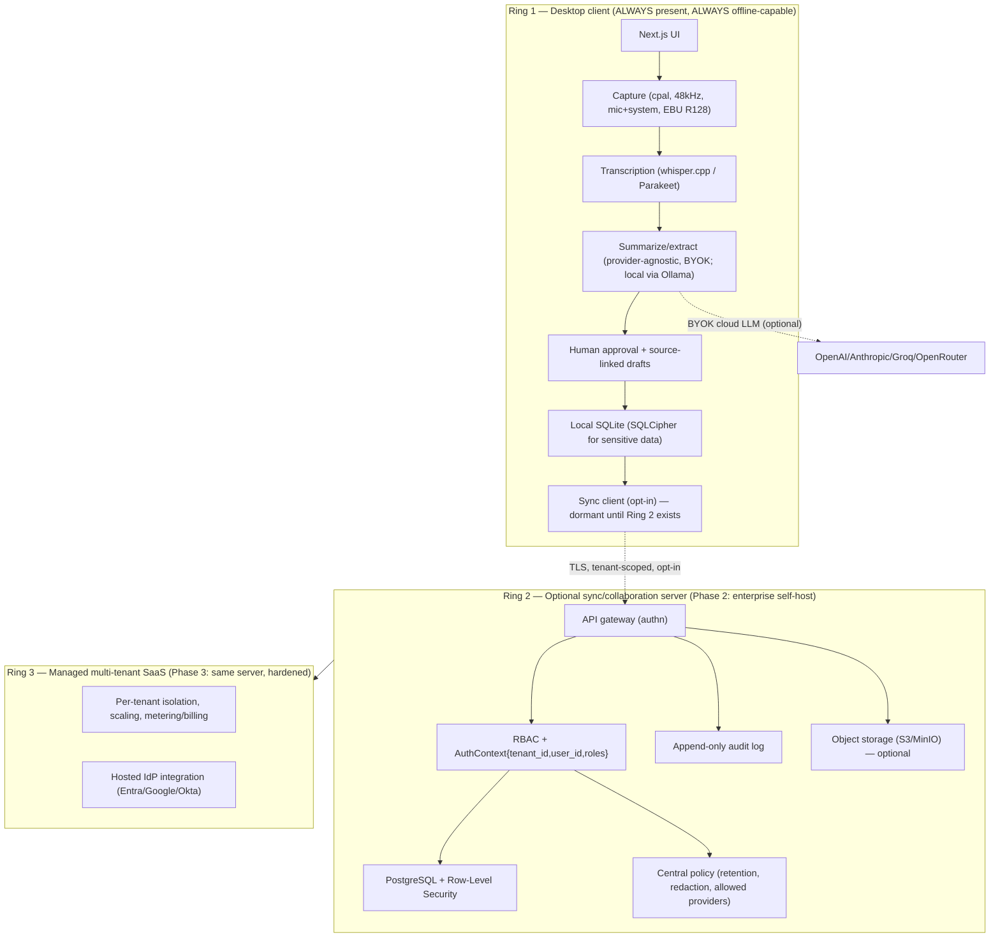
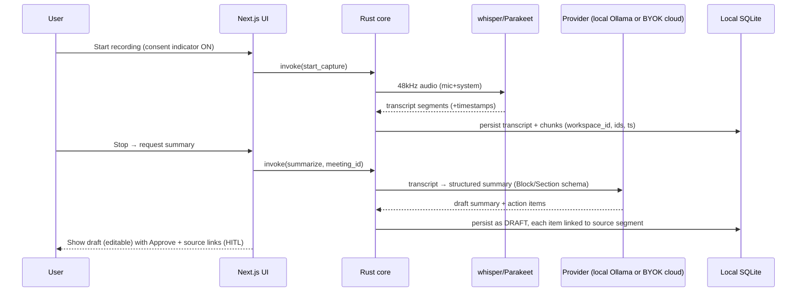

# Architecture

The single most important architectural idea: **local-first now, tenant-aware by design, server-optional and additive later.** We never trade away offline capability to gain team/SaaS features; we add a seam that stays dormant until we need it.

## Ground truth (what the Meetily base actually is)

The supported base is a **Tauri 2 desktop app**. The Rust core (`frontend/src-tauri/`) owns audio capture, transcription (whisper.cpp + Parakeet), LLM/summarization (Rust provider clients, BYOK), and local SQLite. The Next.js UI (`frontend/src/`) talks to the core via Tauri `invoke()`. **The Python `backend/` is archived/legacy** (unauthenticated, dev-only CORS) — reference only, never a runtime dependency.

## Target architecture (three concentric rings)

**Rule:** code in Ring 1 must never assume Ring 2/3 exist. Ring 2/3 must never assume they are the only client (a user may be offline for days and sync later).

## The seam: how local-first becomes multi-tenant without a rewrite

Four seams are introduced **now**, even while single-tenant:

1. **`WorkspaceContext` / `AuthContext`.** All domain access goes through a context object. In Ring 1 it resolves to a single local workspace + implicit local user. On the server it resolves to a real authenticated tenant/user. Code never reads "the current user" any other way.
2. **`tenant_id`/`workspace_id` on every entity.** Present from the first migration (constant local value in Ring 1). This is what avoids a destructive migration later.
3. **Repository layer.** No ad-hoc SQL in feature code. Repositories take the context and are the only place that touches storage — so tenant scoping is enforced in one layer (plus Postgres RLS on the server for defense in depth).
4. **Sync boundary.** A `sync/` client module (Ring 1) and a sync API (Ring 2) speak a tenant-scoped protocol. Dormant until the server exists; designed now so entities carry `version/rev`, `updated_by`, `deleted_at`.

## Data flow (local-first happy path — no server involved)

## Decision to make before Ring 2 code (record in DECISIONS.md)

- **Server language:** Rust/Axum (one language with the core, share models) vs a clean FastAPI service (faster iteration, reuse the legacy schema/prompts as reference). Default recommendation: **Rust/Axum** for cohesion and to avoid a second stack; choose FastAPI only if team velocity in Rust is a bottleneck.
- **Sync model:** start with **per-field last-write-wins + audit note**; adopt CRDTs only if real concurrent multi-user editing of the same record becomes a requirement.
- **Storage of audio:** default is **transcript-only retention** (delete audio after transcription) to minimize cost and risk; make raw-audio retention an explicit, per-tenant policy.

## Known tech debt inherited from the base (track, converge deliberately)
- **Dual transcription/summary paths** (Rust core vs archived Python backend) — the app is the Rust core; keep the Python code as reference, do not depend on it.
- **`audio/` vs `audio_v2/`** — pick the authoritative one (DECISIONS.md) and converge behind a flag.
- **Multiple rich-text editors** (BlockNote + TipTap + Remirror) — BlockNote is canonical; migrate off the others when touched.
- **`lib_old_complex.rs`** and similar legacy files — do not extend; delete during deliberate cleanup with tests.
